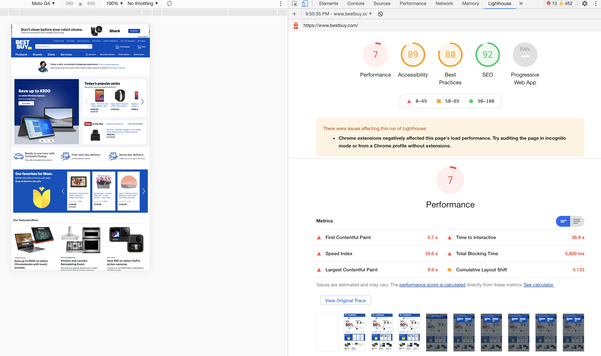
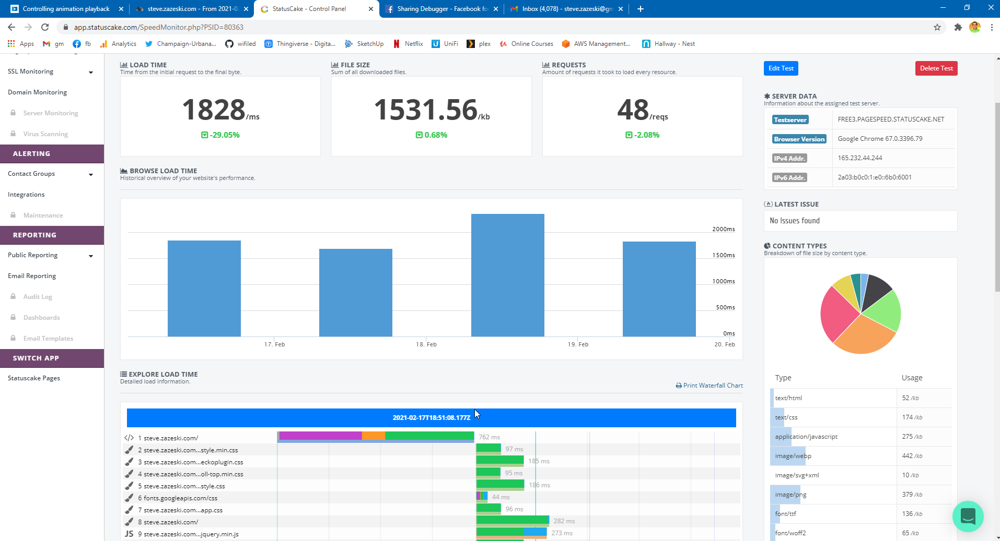

---

theme: gaia
class: lead
paginate: true
backgroundColor: #eff5f5
backgroundImage: url('/assets/white-top.svg')
backgroundSize: 250%
backgroundPosition: center -20px
style: |
    section pre>code {
        background: #222;
    }
    section.lead h1 {
        color: #002279;
    }
    section.lead h1 strong {
        color: #002279;
    }
    footer {
        height: 80px;
        display: flex;
        align-items: center;
        justify-content: flex-end;
        margin-right: 50px
    }
    video {
        display: flex;
        align-self: center;
        box-shadow: black 0px 0px 40px 0px;
        background-color: #47cbbf;

    }
marp: true

---


April 7, 1-4:30PM
# **Performance Testing Workshop**

Using Tools to Measure Performance and Best Practices

https://pixotech.com


---
<!--
footer: ''
_class: lead
-->


---

## About us

---

## Steve Zazeski


- Undergrad at U of I Computer Engineering
- Worked for College of ACES - Extension, now at Pixo
- 

---

## Jason Rambeck

---

## Why performance matters

---

# Internet Speeds in the US


---

# Netflix Speeds

- 0.5mbps min, 3mbps SD, 5mbps HD, 25mbps UHD

---

# Mobile Speeds are increasing


---

# Future 5G


---

https://almanac.httparchive.org/en/2020/performance


---

## User experience

Users studies have shown that page speed is the number one factor in user experience.


Source: [SPEED MATTERS: Designing for mobile performance](https://www.awwwards.com/brain-food-perceived-performance/)

---

## Bounce rate


Source: [Google](https://www.thinkwithgoogle.com/marketing-resources/data-measurement/mobile-page-speed-new-industry-benchmarks/)

---

## Trust

> **Fast websites build trust**
> — _Yesenia Perez Cruz_ [[Youtube]](https://www.youtube.com/watch?v=wBcPEZf0hwI)

---

# What is performance? 

* It is **not** as simple as how many seconds it takes for a page to load.
* There are a number of other **milestones** we can measure on the way to a complete page load that help define performance.
* It is **relative**: What the user wants to do, what their connection speed is, the power of their device.
* New visitors and repeat visitors have a different experience.

---

## Web Vitals

Google created a set of Web Vitals that help us think about (and measure) unique facets of performance experience.

---

## Core Web Vitals

Core Web Vitals are a subset of these metrics they have determined are the most meaningful.


---


# Largest Contentful Paint

[Measures](https://web.dev/lcp/) the time until the page displays what is likely its main content, like a hero image or heading

---


---


# First Input Delay

measures the interactivity of the page, from the user's first interaction to the time the page responds to it.
_Field only metric (not in Lighthouse)_

---


---


# Cumulative Layout Shift

measures the degree of layout instability on the page, due to shifts like asynchronously loaded content being injected

---

<video width="700" class="bg" poster="/assets/play.svg" onclick="this.paused ? this.play() : this.pause(); this.blur()" onpause="">
    <source src="/assets/layout-instability2.webm" type="video/mp4">
</video>

---

# Other Web Vitals


---

# Speed Index (SI)

[Measures](https://web.dev/speed-index/) how quickly content is visually displayed during page load. Lighthouse first captures a video of the page loading in the browser and computes the visual progression between frames.
  
---


---

# First Contentful paint (FCP)

[Measures](https://web.dev/fcp/) the time from when the page starts loading to when any part of the page's content is rendered on the screen.

---


---

# Time to Interactive (TTI)

[Measures](https://web.dev/tti/) the time from when the page starts loading to when it's visually rendered, its initial scripts (if any) have loaded, and it's capable of reliably responding to user input quickly.

---


---

# Total Blocking Time (TBT)

[Measures](https://web.dev/tbt/) the total amount of time between FCP and TTI where the main thread was blocked for long enough to prevent input responsiveness.


---
<!--
_class: lead
-->


# Lighthouse

---

**There are multiple ways to use Lighthouse.**

* [Google PageSpeed Insights](https://developers.google.com/speed/pagespeed/insights) . Run Lighthouse and link to reports without installing a thing.
* [Chrome DevTools](https://developers.google.com/web/tools/lighthouse#devtools) . Easily audit pages that require authentication, and read your reports in a user-friendly format.
* [Command Line Interface](https://developers.google.com/web/tools/lighthouse#cli) . Automate your Lighthouse runs via shell scripts.
* [Node module](https://developers.google.com/web/tools/lighthouse#programmatic) . Integrate Lighthouse into your continuous integration systems.
---
<!--
_class: _default
-->

### Downside
* No easy way to export
* No "settings"
* Website must be public

### Upside
* Very easy
* Includes "field data" (limited available data)
* API - Can use this as a service to automate or build an application.

---

# Field data vs. Lab data

**Field data:** The Chrome User Experience Report is powered by real user measurement of key user experience metrics across the public web, aggregated from users who have opted-in to syncing their browsing history, have not set up a Sync passphrase, and have usage statistic reporting enabled.

---


---

# Demo PSI

* CNN.com
* BestBuy.com
* Other

---

# bestbuy.com - Desktop


---

# bestbuy.com - Mobile



---

# Chrome DevTools

* Very easy
* Lots of settings available
* Affected by your computing power and internet connection
* Affected by your browser configuration and extensions

---

# Demo in DevTools

* CNN.com
* BestBuy.com
* Other

---

# Find the fastest sites

# Find the worst sites

---

## Best
 - giftofspeed.com - 100


## Worse
 - 


---


# The command line

* Free of browser extensions
* Lots of settings available
* Scripting and automation
* Affected by your computing power and internet connection

---

# Demo CLI

```bash
npm install -g lighthouse
lighthouse https://bestbuy.com --view
```


---

`lighthouse`
 
---

# DevTools

---

## DevTools: Network

* The waterfall
* The filmstrip
* Page size
* Request count
* DOMContentLoaded (Node tree)
* Load (images, assets)
* Finish (async requests)

DEMO

---

## DevTools: Performance profile

* Frames
* Web Vitals timeline
* Timings 
* Experience

DEMO

---

## Throttling

---

# Performance goals

Good performance is contextual. So set goals based on those contexts.

1) See content 
2) Click a thing


---
# Performance budgets

- Lighthouse can run an audit against your goals and show when you are making too many requests or too large of files in categories.
- There is no one set budget
- Download our sample budget with all options on [github.com](https://github.com/pixotech/performance-workshop/blob/production/lighthouse-sample-configs/budget-sample.json)
- can only be used with cli or ci version

---

# Auditing a page

--- 

Download the [performance audit worksheet]().
## 📋


---

# "We can’t let **best** be the enemy of **better** code."
— Michael Feathers - Working Effectively With Legacy Code

---

# Don't chase a perfect 100 score


- Perfect 100 might be fast, but is it useful
- Metrics are changing, internet is changing, devices are changing

---

# Balance of Performance

App <-> Single File Website <-> All separate files

- 
- How fast does the site update?
- What connection does your user have?

---

# There is no one best, most performant website
it depends on your user's use cases

---

# Waterfall View


---

# Ideal Waterfall*

[**Single Request**](http://webcon-performance-pixotech-com.s3-website-us-east-1.amazonaws.com/example-sites/single-call.html)


---

# Real Ideal Waterfall


---
# Option Menu in Waterfall hides alot


---

# Statuscake Page Speed Monitoring

- Free version will check 1 webpage per day



- Can set alerts if load time or file size goes over a set level
- Can throttle connection to simulate mobile

---

# Number of Concurrent Connections

Number of seperate resources that need to be loaded matters.

- Chrome 89 == **6**
- Firefox 68 == **9**
- Edge 18 == **12**

---

# Default Concurrent

- Apache == 8 threads **150**
- nginx == **512**
- iis == **5000**

---

# hey


- is a simple command line tool to place load on a webserver
    - `brew install hey` or download from https://github.com/rakyll/hey
- Be careful running the default settings
    - `hey https://poor-performance.pixodev.net` 50/s for 250 requests
    - `hey -n 500 -c 10 https://poor-performance.pixodev.net` 500 requests at 10/s
    - `hey -z 10m -c 5 https://poor-performance.pixodev.net` runs for 10m with 5/s

---

# Common Lighthouse Issues

- Properly size images
- HTTP/2
- Serve static assets with an efficient cache policy
- Image elements do not have explicit width and height
- Avoid enormous network payloads
- Minimize main-thread work

---

# Nginx

- Created in 2002 to solve the C10k issue for Rambler search engine
- Designed to outperform Apache, not as flexible
- Uses a different paradigm to avoid fork bombing and uses much less memory
- Its more difficult to setup, lots of docker containers just have apache

---

# HTTP/2
- introduced May 2015, support added in Chrome 51
- Tries to fix the concept of multiple separate connections to the same server by opening a stream and pushing multiple requests through it.

---

# Enable HTTP/2 in apache

on docker
`RUN a2enmod http2`


https://tools.keycdn.com/http2-test

---

# HTTP/3
- Introduced Feb 2021
- Replaces `TCP` for `QUIC` (pronounced QUICK) which is roughly a modified `UDP`
- TCP doesn't like out of order packet
- 14% of web servers, 7% of desktops, 0% of mobile support it (April 2021)
- (Chrome 79*, firefox 72*, safari 14)
---

Gzip / Brotli

- Module for Apache/nginx that compresses files in transit (mostly html, css, and js) during the transfer

- `mod_deflate` or `mod_gzip` or `mod_


https://tools.keycdn.com/brotli-test


---

# Serve static assets with an efficient cache policy 
  - Add headers `Cache-Control: max-age=31536000`
  - Apache or Nginx create or edit the root `.htaccess`
 ```
<FilesMatch ".(gif|jpg|jpeg|png|ico)$">
    Header set Cache-Control "max-age=#####"
</FilesMatch>
 ```
  - `86400` = 1 day, `604800` = 1 week, `2419200` = 1 month, `29030400` = 1 year

---

# Cache-Control Headers

## public
The response may be stored in any cache

## private
The response may be stored only in the browser's cache

---

# Cache-Control Headers

## no-cache
The response may be stored by any cache, even if the response is normally non-cacheable. However, the stored response MUST always go through validation with the origin server first before using it.

## no-store
The response may not be stored in any cache. Note that this will not prevent a valid pre-existing cached response being returned. Clients can set max-age=0

---

# Apache Cache with `mod_expires`
```
<IfModule mod_expires.c>
    ExpiresActive On
    ExpiresByType image/jpeg "access plus 1 year"
    ExpiresByType image/gif "access plus 1 year"
    ExpiresByType image/png "access plus 1 year"
    ExpiresByType image/webp "access plus 1 year"
    ExpiresByType image/svg+xml "access plus 1 year"
    ExpiresByType image/x-icon "access plus 1 year"
    ExpiresByType video/mp4 "access plus 1 year"
    ExpiresByType video/mpeg "access plus 1 year"
    ExpiresByType text/css "access plus 1 week"
    ExpiresByType text/javascript "access plus 1 month"
    ExpiresByType application/javascript "access plus 1 month"
    ExpiresByType application/pdf "access plus 1 month"
</IfModule>
```
---

# Apache Cache with `mod_headers`
```
<ifModule mod_headers.c> 
    # One year for image and video files
    <filesMatch ".(flv|gif|ico|jpg|jpeg|mp4|mpeg|png|svg|swf|webp)$">
        Header set Cache-Control "max-age=31536000, public"
    </filesMatch>

    # One month for JavaScript and PDF files
    <filesMatch ".(js|pdf)$">
        Header set Cache-Control "max-age=2592000, public"
    </filesMatch>

    # One week for CSS files
    <filesMatch ".(css)$">
        Header set Cache-Control "max-age=604800, public"
    </filesMatch>
</ifModule>
```

---

# nginx cache

`/etc/nginx/sites-available/default`
```
# Expires map
map $sent_http_content_type $expires {
    default                    off;
    text/html                  epoch;
    text/css                   max;
    application/javascript     max;
    ~image/                    max;
}

server {
    listen 80 default_server;
    listen [::]:80 default_server;

    expires $expires;
```

---

- When DevTools is open, it defaults to Disable cache
- Not realistic to what users will see


___

# Cache Busting

`image.png`

`image.png?20210403`
- Your browser will treat this as a new file

---

# Wordpress: Wp Super Cache

A very easy to use caching solution. This improves php load time, it doesn't minify css or change image formats.


---

# Wordpress: WebP Converter for Media

  - Auto converts JPG/PNG to WebP
  - Uses .htaccess to redirect .jpg/.png to a php file to decide what to serve
  - Requires a gd library with webp support

- Most plugins use remote conversion and a limit/cost per image
  
  
---

# PageSpeed Modules
https://www.modpagespeed.com/

- Module that loads into Apache or Nginx and **best-effort** improves site performance automatically
    - css
    - images
    - minify

---

# Next Gen Image Formats

Original is 2044x3840 pixels

- gif     6.4MB
- jpg     1.8MB
- png    12.8MB
- webp    7.9MB

---

# Image Compression deep-dive

https://www.youtube.com/watch?v=F1kYBnY6mwg


---
- Lossy vs Lossless vs Vector
- https://squoosh.app

---


# Lighthouse-ci
Continuous Integration for Lighthouse

https://github.com/GoogleChrome/lighthouse-ci

`npm install -g @lhci/cli`

`lhci collect --url https://pixotech.com`
`lhci open`
`lhci upload`

`lhci autorun`

---

# When to use lhci instead of lighthouse

- You want automated runs of lighthouse

---


# Getting started with lhci

```
mkdir steve-zazeski-com-lighthouse
git init
# 

lhci collect --url https://pixotech.com
git commit --allow-empty -m 'Run for `date -u +"%Y.%m.%d-%H.%M"`
lhci open
lhci upload --config lhci.conf

```

---

# lighthouserc.json
(lighthouse runtime config)

- Place this in the root of the site and then run `lhci autorun`

```
// lighthouserc.js
module.exports = {
  ci: {
    collect: {
       startServerCommand: 'npm run server',
       url: ['http://localhost:4000/'],
       numberOfRuns: 5,
    },
    assert: {
       preset: 'lighthouse:all' // lighthoues:recommended, lighthouse:no-pwa
       // budgetFile: './lighthousebudget.json' 
    },
    upload: {
      target: 'temporary-public-storage',
    },
  },
};
```

---

# Lighthouse with Jenkins

```

```

---

# DNS

- Penalty you pay on first load of a sub/domain
- Fast sites lookup in ~20ms
- Normal sites lookup less than ~100ms

`dig pixotech.com` mac linux
`nslookup -debug pixotech.com` win

```
; <<>> DiG 9.10.6 <<>> pixotech.com
;pixotech.com.			IN	A
pixotech.com.		77	IN	A	52.34.48.14
;; Query time: 82 msec
```

---

# DNS - CNAMES

- All DNS queries recurse until they end in A / AAAA record

```
build.pixotech.com.	299	IN	CNAME	on-premise-docker-swarm.pixodev.net.
on-premise-docker-swarm.pixodev.net. 59	IN CNAME icarus.pixodev.net.
icarus.pixodev.net.	59	IN	A	173.167.185.184

;; Query time: 219 msec
```

---

# Fastest Resolution

- Bare A Records if possible
- Higher TTLs (median is 300)
    - 1800s = microsoft.com
    - 300s = facebook.com gmail.com youtube.com google.com apple.com
    - upstream dns typically do not acknowledge a TTL of less than 30 seconds.

---

# Real Mobile Testing
- Devtools uses artifical network and cpu slowdowns


---

# scrcpy

---

# DevTools on Mobile Devices

1. Connect phone via USB
1. Enable Developer Mode on the phone ()
1. Authorize debugging (will reprompt in 14 days)
1. Goto **chrome:\\inspect** on your desktop chrome
1. Click **inspect** on the tab you want to open devtools on

---


---

# PWA

Progressive web apps are coming with moderate support on iOS and Android.

- JS code that can run offline through service workers
- Cache layer for offline
- Be careful with service workers (create-react-app)

---
